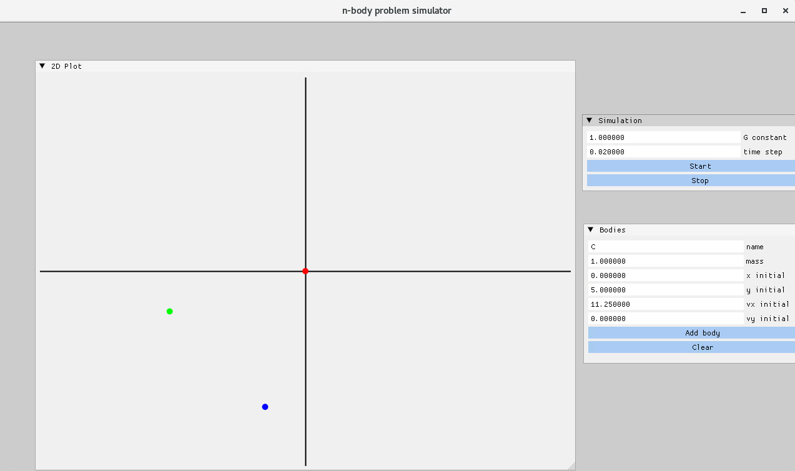

# MultiBodySolver

## Graphical solver of the n-body problem

Solves the kinematics of n bodies interacting in a gravitational environment as an initial value ODE problem.

Can be built on Linux platforms with a minimal set of dependecies.
